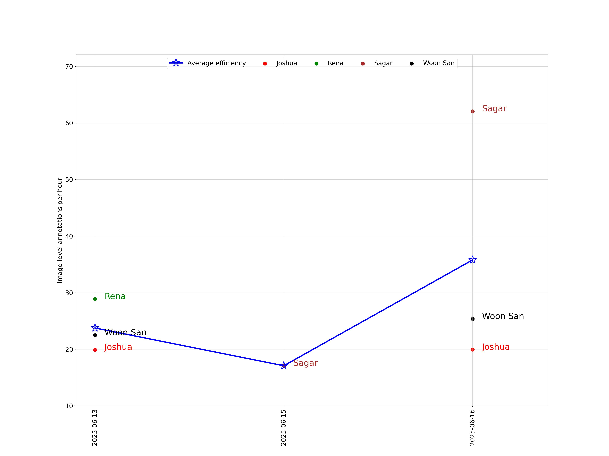

# Dx Annotator Annotation Report

## Introduction

This report summarises the progress of the annotation process on our annotation platform, [Dx Annotator](http://uat.dxa.becertain.ai/). You can find the following information in this report:
* Number of annotators.
* Number of annotated/unannotated images.
* Number of annotations.
* Number of annotations each annotator has contributed.
* Efficiency of annotators (number of annotated images/annotations per hour).
* Some statistics about collected annotations (size of bounding boxes, type of annotated objects, percentage of healthy and unhealthy images, etc.).

## Progress

As of the date of the report, there are **4 annotators** who have contributed to the re-annotation process. These annotators have made **1,892 object-level annotations** and **327 image-level annotations** on **250 dental X-rays**.

Total number of uploaded images: 800 (400 Preston, 400 Bricketwood).

**Retirement limit = 5:**

- 400 images from Preston were uploaded to Dx Annotator on 2025-06-03.
- 400 images from Bricketwood were uploaded to Dx Annotator on 2025-06-03.

The following line chart shows the total number of image-level annotations, the total number of object-level annotations, and the total number of annotated images, as of the date of the report:
<h3 style="text-align: center;" markdown="1">Figure 1. History of the total number of image-level annotations, the total number of object-level annotation, and the total number of annotated images. 
  
- "Image-level" means an image annotated by N annotators is counted as N image-level annotations.
- "Object-level" means every bounding box is counted as one object-level annotation.
- The quantity "Total number of annotated images" is the number of non-identical images that has been annotated at least once. </h3>

The following line chart shows the overall efficiency of annotators in each annotation session, image-level and object-level, along with the number of object-level annotations per image-level annotation:
<h3 style="text-align: center;" markdown="1">Figure 2. History of the overall hourly efficiency (image-level and object-level) of annotators, and the number of object-level annotations per image-level annotation.</h3>

The following line chart shows the number of image-level annotations and the number of object-level annotations we collected each day, along with the total working hours of annotators each day:
<h3 style="text-align: center;" markdown="1">Figure 3. History of the number of collected image-level annotations, the number of collected object-level annotations, and working hours of annotators each day.</h3>

Click this [link](./list_of_annotated_images.md) for the list of annotated images, along with which images were annotated by how many and which annotators.

Below is a histogram of the number of annotators per image.

<h3 style="text-align: center;" markdown="1">Figure 4. Histogram of the number of annotators per image.</h3>

Statistics below are for the 1325 Belmont images and annotations:

- 550 images were annotated by 0 annotators.

- 177 images were annotated by 1 annotators.

- 69 images were annotated by 2 annotators.

- 4 images were annotated by 3 annotators.

- 0 images were annotated by 4 annotators.

- 0 images were annotated by 5 annotators.

For retirement limit = 4 : we need  550*(4) + 177*(4-1) + 69*(4-2) + 4*(4-3) = **2873** image-level annotations to finish this round of annotation.

Click this [link](./list_of_annotators_and_annotations.md) for the list of annotators, along with which annotator has annotated how many and which images, and their working efficiency.

Below is a pie chart showing the number of image-level annotations each annotator has contributed.
<h3 style="text-align: center;" markdown="1">Figure 5. The number and percentage of image-level annotations each annotator has contributed</h3>

Below is a pie chart showing the number of object-level annotations each annotator has contributed.
<h3 style="text-align: center;" markdown="1">Figure 6. The number and percentage of object-level annotations each annotator has contributed.</h3>

The following bar chart compares the efficiency of different annotators, object-level and image-level.
<h3 style="text-align: center;" markdown="1">Figure 7. Comparison of the efficiency of different annotators.</h3>

The image-level efficiency of annotators can be found in the following line chart:
<h3 style="text-align: center;" markdown="1">Figure 8. History of image-level efficiency of different annotators.</h3>

The object-level efficiency of annotators can be found in the following line chart:
<h3 style="text-align: center;" markdown="1">Figure 9. History of object-level efficiency of different annotators.</h3>

Below is a list of annotation types and the number of annotations we have collected for each annotation type.
<h3 style="text-align: center;" markdown="1">Table 1. List of annotation types and the number of annotations for each type, sorted alphabetically.</h3>

|Annotation type| Abbreviation| Number of annotations of the type|
|:-:|:-:|:-:|
| Bone Loss Stage 1: <15%                            | BL-1       | 270  |
| Bone Loss Stage 2: Coronal Third                   | BL-2       | 466  |
| Bone Loss Stage 3: Mid Third                       | BL-3       | 148  |
| Bone Loss Stage 4: Apical Third                    | BL-4       | 29   |
| Calculus                                           | Cal        | 247  |
| Dental Caries Grade 1: Outer Enamel                | DC-1       | 57   |
| Dental Caries Grade 2: Inner Enamel                | DC-2       | 42   |
| Dental Caries Grade 3: Outer Dentin                | DC-3       | 123  |
| Dental Caries Grade 4: Middle Dentin               | DC-4       | 84   |
| Dental Caries Grade 5: Inner Dentin                | DC-5       | 146  |
| External Resorption                                | ER         | 17   |
| Healthy                                            | Healthy    | 55   |
| Missing Coronal Restoration                        | MCR        | 7    |
| Open Margin                                        | OM         | 35   |
| Other                                              | Other      | 17   |
| Overhang                                           | OH         | 67   |
| Periapical Radiolucency                            | PR         | 52   |
| Remaining Root                                     | RR         | 7    |
| Restoration Radiolucency Adhesive/Liner            | RR (A/L)   | 15   |
| Unsure                                             | Unsure     | 8    |

A bar chart showing the number of annotated objects in each annotation type can be found below:
<h3 style="text-align: center;" markdown="1">Figure 10. The number of annotations for each annotation type.</h3>

Histograms showing the distribution of the width and height of bounding boxes are as follows: 
<h3 style="text-align: center;" markdown="1">Figure 11. The histogram of the height and width of bounding boxes.</h3>

Histograms showing the distribution of the width and height of annotated images are as follows: 
<h3 style="text-align: center;" markdown="1">Figure 12. The histogram of the height and width of annotated images.</h3>

Excel sheets showing the number of annotations and annotated images each annotator has contributed in each hour, and the total working hours in each day can be found in the [link](./Excel_files/).
