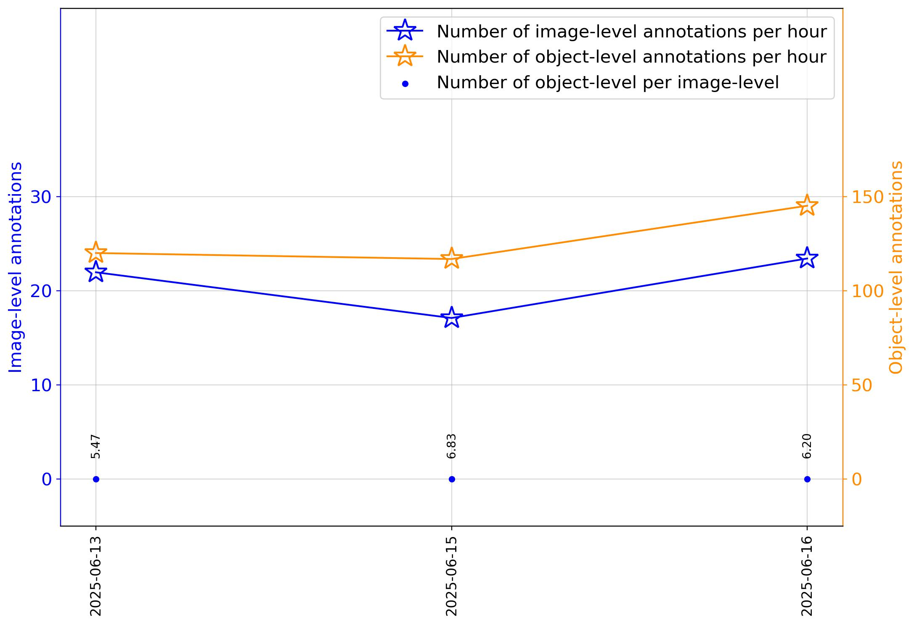
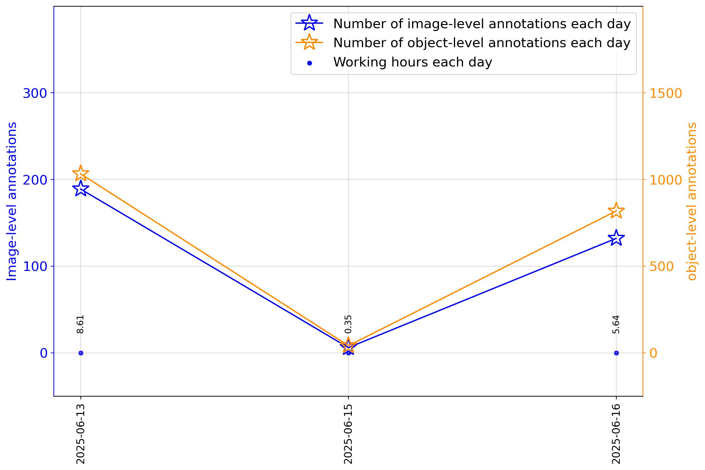
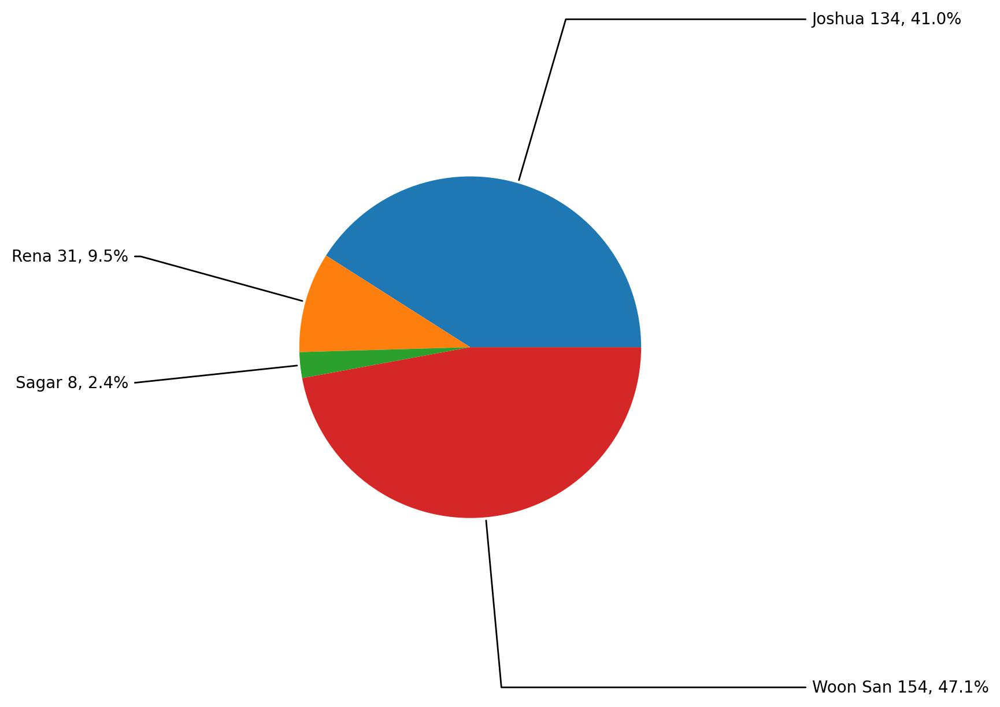
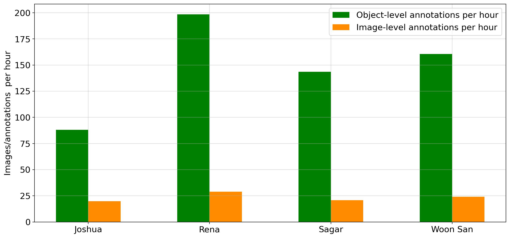
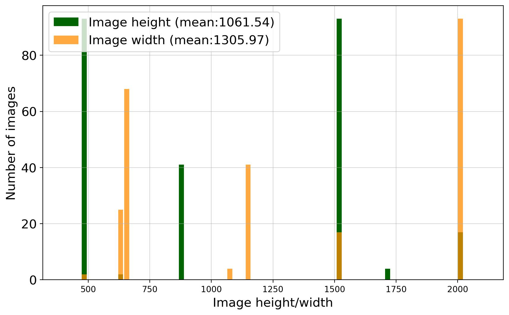

# DR CAPS Annotation Report - 4th Round - re-annotate

## Introduction

This report summarises the progress of the annotation process on our annotation platform, [Dental Radiograph Collection Annotation and Prediction System](https://drcaps.surrey.ac.uk/) (DR CAPS). You can find the following information in this report:
* Number of annotators.
* Number of annotated/unannotated images.
* Number of annotations.
* Number of annotations each annotator has contributed.
* Efficiency of annotators (number of annotated images/annotations per hour).
* Some statistics about collected annotations (size of bounding boxes, type of annotated objects, percentage of healthy and unhealthy images, etc.).

## Progress

As of the date of the report, there are **11 annotators** who have contributed to the re-annotation process. These annotators have made **11,420 object-level annotations** and **1,858 image-level annotations** on **1325 dental X-rays**.

Total number of uploaded images: 1325 (Belmont).

**Retirement limit = 1:**

- 1325 images from Belmont Dental Care that need to be re-annotated were uploaded to DR CAPS on 2024-10-29.
- 513 images from Belmont Dental Care that need to be re-annotated were uploaded to DR CAPS on 2024-11-04.

The following line chart shows the total number of image-level annotations, the total number of object-level annotations, and the total number of annotated images, as of the date of the report:
<h3 style="text-align: center;" markdown="1">Figure 1. History of the total number of image-level annotations, the total number of object-level annotation, and the total number of annotated images. 
  
- "Image-level" means an image annotated by N annotators is counted as N image-level annotations.
- "Object-level" means every bounding box is counted as one object-level annotation.
- The quantity "Total number of annotated images" is the number of non-identical images that has been annotated at least once. </h3>

The following line chart shows the overall efficiency of annotators in each annotation session, image-level and object-level, along with the number of object-level annotations per image-level annotation:
<h3 style="text-align: center;" markdown="1">Figure 2. History of the overall hourly efficiency (image-level and object-level) of annotators, and the number of object-level annotations per image-level annotation.</h3>

The following line chart shows the number of image-level annotations and the number of object-level annotations we collected each day, along with the total working hours of annotators each day:
<h3 style="text-align: center;" markdown="1">Figure 3. History of the number of collected image-level annotations, the number of collected object-level annotations, and working hours of annotators each day.</h3>

Click this [link](./History/2025_06_16/list_of_annotated_images.md) for the list of annotated images, along with which images were annotated by how many and which annotators.

Below is a histogram of the number of annotators per image.

<h3 style="text-align: center;" markdown="1">Figure 4. Histogram of the number of annotators per image.</h3>

Statistics below are for the 1325 Belmont images and annotations:

- 0 images were annotated by 0 annotators.

- 806 images were annotated by 1 annotators.

- 505 images were annotated by 2 annotators.

- 14 images were annotated by 3 annotators.

- 0 images were annotated by 4 annotators.

- 0 images were annotated by 5 annotators.

For retirement limit = 4 : we need  0*(4) + 806*(4-1) + 505*(4-2) + 14*(4-3) = **3442** image-level annotations to finish this round of annotation.

Click this [link](./History/2025_06_16/list_of_annotators_and_annotations.md) for the list of annotators, along with which annotator has annotated how many and which images, and their working efficiency.

Below is a pie chart showing the number of image-level annotations each annotator has contributed.
<h3 style="text-align: center;" markdown="1">Figure 5. The number and percentage of image-level annotations each annotator has contributed</h3>

Below is a pie chart showing the number of object-level annotations each annotator has contributed.
<h3 style="text-align: center;" markdown="1">Figure 6. The number and percentage of object-level annotations each annotator has contributed.</h3>

The following bar chart compares the efficiency of different annotators, object-level and image-level.
<h3 style="text-align: center;" markdown="1">Figure 7. Comparison of the efficiency of different annotators.</h3>

The image-level efficiency of annotators can be found in the following line chart:
<h3 style="text-align: center;" markdown="1">Figure 8. History of image-level efficiency of different annotators.</h3>

The object-level efficiency of annotators can be found in the following line chart:
<h3 style="text-align: center;" markdown="1">Figure 9. History of object-level efficiency of different annotators.</h3>

Below is a list of annotation types and the number of annotations we have collected for each annotation type.
<h3 style="text-align: center;" markdown="1">Table 1. List of annotation types and the number of annotations for each type, sorted alphabetically.</h3>

|Annotation type| Abbreviation| Number of annotations of the type|
|:-:|:-:|:-:|
| Bone Loss (Stage 1: <15%)                          | BL-1       | 2518 |
| Bone Loss (Stage 2: Coronal Third)                 | BL-2       | 2889 |
| Bone Loss (Stage 3: Mid Third)                     | BL-3       | 711  |
| Bone Loss (Stage 4: Apical Third)                  | BL-4       | 164  |
| Calculus                                           | Cal        | 1172 |
| Dental Caries (Grade 1: Outer Enamel)              | DC-1       | 142  |
| Dental Caries (Grade 2: Inner Enamel)              | DC-2       | 146  |
| Dental Caries (Grade 3: Outer Dentin)              | DC-3       | 578  |
| Dental Caries (Grade 4: Middle Dentin)             | DC-4       | 279  |
| Dental Caries (Grade 5: Inner Dentin)              | DC-5       | 373  |
| External Resorption                                | ER         | 23   |
| Healthy                                            | Healthy    | 165  |
| Internal Resorption                                | IR         | 1    |
| Missing Coronal Restoration                        | MCR        | 112  |
| Open Margin                                        | OM         | 399  |
| Other                                              | Other      | 298  |
| Overhang                                           | OH         | 580  |
| Periapical Radiolucency                            | PR         | 322  |
| Remaining Root                                     | RR         | 120  |
| Restoration Radiolucency (Adhesive/Liner)          | RR (A/L)   | 107  |
| Unsure                                             | Unsure     | 208  |

A bar chart showing the number of annotated objects in each annotation type can be found below:
<h3 style="text-align: center;" markdown="1">Figure 10. The number of annotations for each annotation type.</h3>

Histograms showing the distribution of the width and height of bounding boxes are as follows: 
<h3 style="text-align: center;" markdown="1">Figure 11. The histogram of the height and width of bounding boxes.</h3>

Histograms showing the distribution of the width and height of annotated images are as follows: 
<h3 style="text-align: center;" markdown="1">Figure 12. The histogram of the height and width of annotated images.</h3>

Excel sheets showing the number of annotations and annotated images each annotator has contributed in each hour, and the total working hours in each day can be found in the [link](./History/2025_06_16/Excel_files/).

Below is a list of annotators' object-level precision, recall, and F1 score after the calibration session, computed by using the updated model's annotations as the reference annotations. Update logs:
- Changed filter rules for open margin and periapical radiolucency.
- Removed overlapping boxes of the same class.

<h3 style="text-align: center;" markdown="1">Table 2. List of annotators' object-level precision, recall, and F1 score computed with the updated model.</h3>

|Annotator| | | | | | |
|:-:|:-:|:-:|:-:|:-:|:-:|:-:|
|**2024/10/30 - 2024/11/03**|**No. images**| **No. annotations**| **No. model's annotations**| **Precision**| **Recall**| **F1 Score**|
| Annotator4            | 122   | 860  | 845  | 61.7   | 61.3   | 61.5  |
| Annotator9            | 151   | 1437 | 1073 | 54.3   | 69.2   | 60.9  |
| Annotator3            | 173   | 1221 | 1124 | 57.7   | 61.7   | 59.6  |
| Annotator8            | 32    | 273  | 209  | 47.3   | 59.3   | 52.6  |
| Annotator1            | 441   | 1579 | 2918 | 58.6   | 32.9   | 42.2  |
|**2024/11/04 - 2024/11/10**|**No. images**| **No. annotations**| **No. model's annotations**| **Precision**| **Recall**| **F1 Score**|
| Annotator9            | 103   | 981  | 736  | 57.5   | 72.4   | 64.1  |
| Annotator10           | 66    | 526  | 428  | 56.1   | 61.4   | 58.6  |
| Annotator5            | 93    | 593  | 580  | 53.0   | 47.4   | 50.0  |
| Annotator2            | 34    | 380  | 192  | 37.4   | 74.0   | 49.7  |
| Annotator3            | 64    | 390  | 413  | 50.0   | 48.4   | 49.2  |
| Annotator11           | 105   | 546  | 678  | 46.0   | 36.7   | 40.8  |
| Annotator7            | 78    | 185  | 516  | 53.5   | 21.5   | 30.7  |
|**2024/11/11 - 2024/11/17**|**No. images**| **No. annotations**| **No. model's annotations**| **Precision**| **Recall**| **F1 Score**|
| Annotator8            | 56    | 469  | 422  | 51.6   | 56.6   | 54.0  |
| Annotator6            | 221   | 1119 | 1544 | 56.2   | 43.4   | 49.0  |
| Annotator5            | 99    | 632  | 636  | 52.1   | 44.2   | 47.8  |
| Annotator2            | 10    | 116  | 57   | 33.6   | 64.9   | 44.3  |
|**2024/11/18 - 2024/11/22**|**No. images**| **No. annotations**| **No. model's annotations**| **Precision**| **Recall**| **F1 Score**|
| Annotator8            | 8     | 94   | 89   | 66.0   | 66.3   | 66.1  |
| Annotator5            | 3     | 19   | 13   | 63.2   | 69.2   | 66.1  |

The figures below displays the precision, recall, and F1 scores for each annotator, along with their average and weighted average precision, recall, and F1 score. The average is calculated as the mean of the annotators’ performance metrics, while the weighted average takes into account the number of annotations made by each annotator.
<h3 style="text-align: center;" markdown="1">Figure 13. History of annotators' precision.</h3>

<h3 style="text-align: center;" markdown="1">Figure 14. History of annotators' recall</h3>

<h3 style="text-align: center;" markdown="1">Figure 15. History of annotators' F1 score.</h3>

